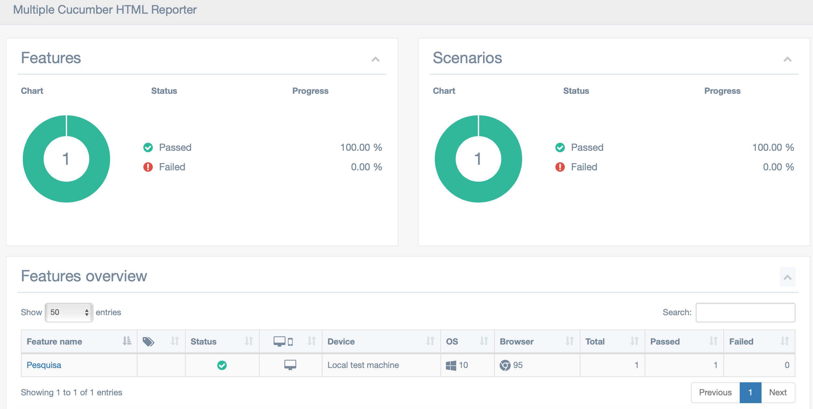

# Bem vindos ao Cypress utilizando Cucumber

> É uma ferramenta de teste de front-end de próxima geração desenvolvida para a web moderna

# Por que Cypress ?
> O Cypress pode testar qualquer coisa que seja executada em um navegador e permite que você escreva os tipos de testes:

* Testes ponta a ponta
* Testes de integração
* Testes de unidade

# Pré requisitos

* [Node JS](https://nodejs.org/en/download/)
* [Visual Studio Code](https://code.visualstudio.com/download) 
* [Cypress](https://www.cypress.io/) 

> Alguns plugins do VSCode que facilitaram seu dia a dia :
- cucumber (Gherkin)
- cuke step definition generator
- vscode-icons

# Clonando o projeto
```
git clone https://github.com/danilopolicarpos/cypress.git
```

# Instalando as dependências do projeto
```
npm install
```

# Visualizar o modo interativo do Cypress
```
npm run open
```

# Executar os testes no chrome via linha de comando
```
npm run test
```

# Gerar o Relatório de testes
```
npm run report
```

# Referências
- https://codenboxautomationlab.com/cucumber-html-report/
- https://nodejs.org/en/download/
- https://code.visualstudio.com/download
- https://www.cypress.io/